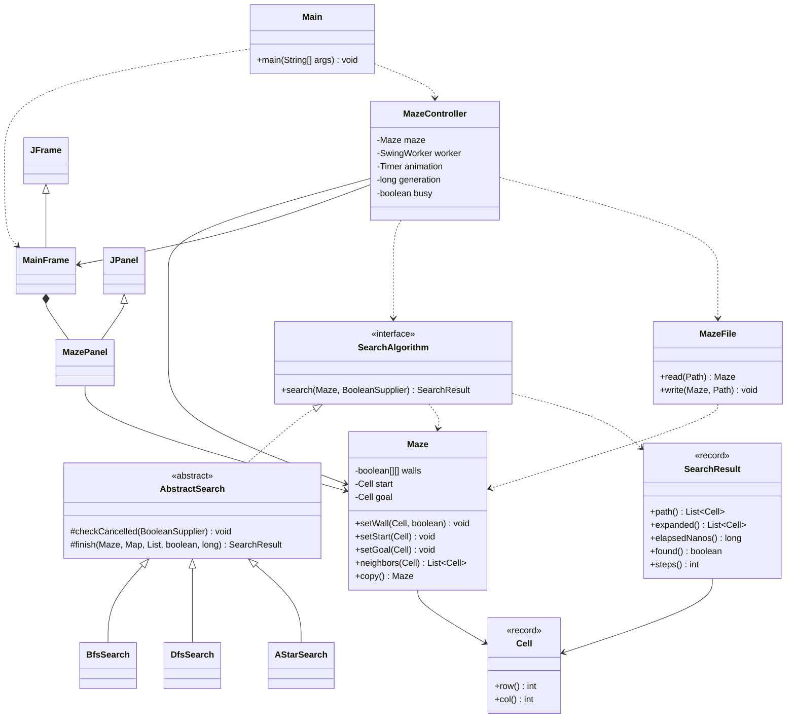

# Sơ đồ lớp UML

Mở bằng trình Markdown hỗ trợ Mermaid. Các lớp dưới đây tương ứng với mã nguồn; thuộc tính/phương thức chỉ liệt kê phần chính.

```mermaid
classDiagram
class Main {
  +main(String[] args) void
}
class Cell {
  <<record>>
  +row() int
  +col() int
}
class Maze {
  -boolean[][] walls
  -Cell start
  -Cell goal
  +setWall(Cell, boolean) void
  +setStart(Cell) void
  +setGoal(Cell) void
  +neighbors(Cell) List~Cell~
  +copy() Maze
}
class SearchAlgorithm {
  <<interface>>
  +search(Maze, BooleanSupplier) SearchResult
}
class AbstractSearch {
  <<abstract>>
  #checkCancelled(BooleanSupplier) void
  #finish(Maze, Map, List, boolean, long) SearchResult
}
class BfsSearch
class DfsSearch
class AStarSearch
class SearchResult {
  <<record>>
  +path() List~Cell~
  +expanded() List~Cell~
  +elapsedNanos() long
  +found() boolean
  +steps() int
}
class MazeController {
  -Maze maze
  -SwingWorker worker
  -Timer animation
  -long generation
  -boolean busy
}
class MainFrame
class JFrame
class MazePanel
class JPanel
class MazeFile {
  +read(Path) Maze
  +write(Maze, Path) void
}
SearchAlgorithm <|.. AbstractSearch
AbstractSearch <|-- BfsSearch
AbstractSearch <|-- DfsSearch
AbstractSearch <|-- AStarSearch
JFrame <|-- MainFrame
JPanel <|-- MazePanel
Maze --> Cell
SearchResult --> Cell
SearchAlgorithm ..> Maze
SearchAlgorithm ..> SearchResult
MazeController --> Maze
MazeController --> MainFrame
MazeController ..> SearchAlgorithm
MazeController ..> MazeFile
MainFrame *-- MazePanel
MazePanel --> Maze
MazeFile ..> Maze
Main ..> MainFrame
Main ..> MazeController
```
